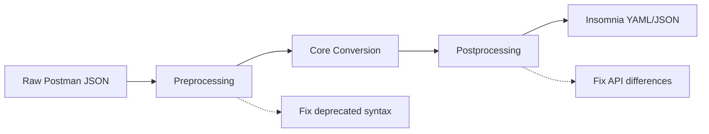

# Transform System Guide

The Postman to Insomnia CLI converter includes a powerful **Transform System** that automatically fixes compatibility issues between Postman and Insomnia APIs. This system operates in two stages: **preprocessing** and **postprocessing**.

## Overview

### Why Transforms Are Needed

When converting Postman collections to Insomnia format, you may encounter several issues:

1. **Deprecated Postman Syntax** - Old collections use outdated API calls
2. **API Differences** - Postman and Insomnia have different APIs for the same functionality
3. **Script Compatibility** - Scripts that work in Postman may fail in Insomnia

The transform system solves these issues automatically using configurable regex-based rules.

### How It Works



1. **Preprocessing**: Fixes deprecated Postman syntax in the raw JSON before conversion
2. **Core Conversion**: Converts `pm.*` calls to `insomnia.*` calls
3. **Postprocessing**: Fixes Insomnia API differences in the converted scripts

## Common Problems Solved

### 🔧 Header Access Issues

**Problem**: Scripts fail with `insomnia.response.headers.get(...).includes is not a function`

**Root Cause**: Postman and Insomnia return different objects from `headers.get()`
- **Postman**: Returns the header value directly (string)
- **Insomnia**: Returns an object with `.value`, `.name`, etc. properties

**Solution**: Postprocessing automatically adds `.value` where needed

```javascript
// Before (fails in Insomnia):
if (insomnia.response.headers.get("Content-Type").includes("json")) {
  // This fails because headers.get() returns an object, not a string
}

// After (works in Insomnia):
if (insomnia.response.headers.get("Content-Type").value.includes("json")) {
  // This works because we access the .value property
}
```

### 🔧 Legacy Postman Syntax

**Problem**: Old collections use deprecated syntax that doesn't convert properly

```javascript
// Deprecated syntax that needs preprocessing:
pm.responseHeaders["Content-Type"]              // Old array access
postman.setEnvironmentVariable("token", value)  // Old function name
tests["Status OK"] = pm.response.code === 200   // Legacy test syntax
```

**Solution**: Preprocessing converts these to modern Postman syntax before conversion

```javascript
// After preprocessing (modern Postman syntax):
pm.response.headers.get("Content-Type")         // Modern header access
pm.environment.set("token", value)              // Modern function name
pm.test("Status OK", function() {               // Modern test syntax
  pm.expect(pm.response.code === 200).to.be.true;
});
```

## Using the Transform System

### Basic Usage

```bash
# Apply both preprocessing and postprocessing (recommended)
postman2insomnia collection.json --preprocess --postprocess

# Apply only preprocessing (fix deprecated syntax)
postman2insomnia collection.json --preprocess

# Apply only postprocessing (fix API differences)
postman2insomnia collection.json --postprocess
```

### Custom Configuration

```bash
# Generate a custom configuration file
postman2insomnia --generate-config ./my-transforms.json

# Use your custom configuration
postman2insomnia collection.json --preprocess --postprocess --config-file ./my-transforms.json
```

## Configuration Format

Transform configurations are JSON files with two main sections:

```json
{
  "preprocess": [
    {
      "name": "fix-responseHeaders",
      "description": "Fix deprecated responseHeaders syntax",
      "pattern": "pm\\.responseHeaders\\[(.*?)\\]",
      "replacement": "pm.response.headers.get($1)",
      "flags": "g",
      "enabled": true
    }
  ],
  "postprocess": [
    {
      "name": "fix-header-includes",
      "description": "Fix header.includes() for Insomnia API",
      "pattern": "insomnia\\.response\\.headers\\.get\\(([^)]+)\\)\\.includes\\(",
      "replacement": "insomnia.response.headers.get($1).value.includes(",
      "flags": "g",
      "enabled": true
    }
  ]
}
```

### Rule Properties

| Property | Description | Example |
|----------|-------------|---------|
| `name` | Unique identifier for the rule | `"fix-header-includes"` |
| `description` | Human-readable description | `"Fix header.includes() calls"` |
| `pattern` | Regular expression pattern to match | `"pm\\.responseHeaders\\[(.*?)\\]"` |
| `replacement` | Replacement string (supports capture groups) | `"pm.response.headers.get($1)"` |
| `flags` | Regex flags (`g`, `i`, `m`, etc.) | `"g"` |
| `enabled` | Whether the rule is active | `true` |

## Built-in Configurations

```json
{
  "_comment": "Transform Configuration - Generated from Default Rules",
  "_description": "Customize preprocessing and postprocessing rules for Postman to Insomnia conversion",
  "_documentation": {
    "preprocess": "Rules applied before pm.* to insomnia.* conversion",
    "postprocess": "Rules applied after pm.* to insomnia.* conversion",
    "pattern": "Regular expression pattern to match (use double backslashes for escaping)",
    "replacement": "Replacement string (use $1, $2, etc. for capture groups)",
    "flags": "Regex flags: 'g' for global, 'i' for case-insensitive, 'm' for multiline",
    "enabled": "Set to false to disable a rule without deleting it"
  },
  "preprocess": [
    {
      "name": "deprecated-pm-syntax",
      "description": "Fix deprecated Postman responseHeaders syntax",
      "pattern": "\\bpm\\.responseHeaders\\[(.*?)\\]",
      "replacement": "pm.response.headers.get($1)",
      "flags": "g",
      "enabled": true
    },
    {
      "name": "old-postman-vars",
      "description": "Convert old postman.getEnvironmentVariable calls",
      "pattern": "\\bpostman\\.getEnvironmentVariable\\((.*?)\\)",
      "replacement": "pm.environment.get($1)",
      "flags": "g",
      "enabled": true
    },
    {
      "name": "old-postman-global-vars",
      "description": "Convert old postman.getGlobalVariable calls",
      "pattern": "\\bpostman\\.getGlobalVariable\\((.*?)\\)",
      "replacement": "pm.globals.get($1)",
      "flags": "g",
      "enabled": true
    },
    {
      "name": "legacy-test-syntax",
      "description": "Convert legacy test syntax",
      "pattern": "\\btests\\[(.*?)\\]\\s*=\\s*(.*?);",
      "replacement": "pm.test($1, function() { pm.expect($2).to.be.true; });",
      "flags": "g",
      "enabled": true
    },
    {
      "name": "legacy-environment-set",
      "description": "Convert postman.setEnvironmentVariable to pm.environment.set",
      "pattern": "\\bpostman\\.setEnvironmentVariable\\s*\\(\\s*(.+?)\\s*,\\s*(.+?)\\s*\\)",
      "replacement": "pm.environment.set($1, $2)",
      "flags": "g",
      "enabled": true
    },
    {
      "name": "legacy-global-set",
      "description": "Convert postman.setGlobalVariable to pm.globals.set",
      "pattern": "\\bpostman\\.setGlobalVariable\\s*\\(\\s*(.+?)\\s*,\\s*(.+?)\\s*\\)",
      "replacement": "pm.globals.set($1, $2)",
      "flags": "g",
      "enabled": true
    },
    {
      "name": "legacy-clear-env",
      "description": "Convert postman.clearEnvironmentVariable to pm.environment.unset",
      "pattern": "\\bpostman\\.clearEnvironmentVariable\\s*\\(\\s*(.+?)\\s*\\)",
      "replacement": "pm.environment.unset($1)",
      "flags": "g",
      "enabled": true
    },
    {
      "name": "legacy-clear-global",
      "description": "Convert postman.clearGlobalVariable to pm.globals.unset",
      "pattern": "\\bpostman\\.clearGlobalVariable\\s*\\(\\s*(.+?)\\s*\\)",
      "replacement": "pm.globals.unset($1)",
      "flags": "g",
      "enabled": true
    },
    {
      "name": "responseCode-to-response",
      "description": "Convert responseCode.code to pm.response.code",
      "pattern": "\\bresponseCode\\.code",
      "replacement": "pm.response.code",
      "flags": "g",
      "enabled": true
    }
  ],
  "postprocess": [
    {
      "name": "fix-header-conditional-access",
      "description": "Fix header access in conditional statements",
      "pattern": "insomnia\\.response\\.headers\\.get\\(([^)]+)\\)\\s*&&\\s*insomnia\\.response\\.headers\\.get\\(\\1\\)\\.(?!value\\b)(\\w+)",
      "replacement": "insomnia.response.headers.get($1) && insomnia.response.headers.get($1).value.$2",
      "flags": "g",
      "enabled": true
    },
    {
      "name": "fix-header-string-comparison",
      "description": "Fix header string comparisons",
      "pattern": "insomnia\\.response\\.headers\\.get\\(([^)]+)\\)\\s*(===|!==|==|!=)\\s*",
      "replacement": "insomnia.response.headers.get($1).value $2 ",
      "flags": "g",
      "enabled": true
    },
    {
      "name": "fix-header-value-access",
      "description": "Fix header value access for Insomnia API",
      "pattern": "insomnia\\.response\\.headers\\.get\\(([^)]+)\\)\\.(?!value\\b)(\\w+)",
      "replacement": "insomnia.response.headers.get($1).value.$2",
      "flags": "g",
      "enabled": true
    },
    {
      "name": "fix-request-headers-add",
      "description": "Convert insomnia.request.headers.add() to insomnia.request.addHeader()",
      "pattern": "insomnia\\.request\\.headers\\.add\\s*\\(\\s*\\{([\\s\\S]*?)\\}\\s*\\)\\s*;?",
      "replacement": "insomnia.request.addHeader({$1});",
      "flags": "g",
      "enabled": true
    },
    {
      "name": "fix-request-url-assignment",
      "description": "Convert insomnia.request.url assignment to update() method",
      "pattern": "insomnia\\.request\\.url\\s*=\\s*([^;]+);?",
      "replacement": "insomnia.request.url.update($1);",
      "flags": "g",
      "enabled": true
    },
    {
      "name": "fix-response-json-access",
      "description": "Fix response JSON access if needed",
      "pattern": "insomnia\\.response\\.json\\(\\)\\.(?!data\\b)(\\w+)",
      "replacement": "insomnia.response.json().$1",
      "flags": "g",
      "enabled": false
    }
  ]
}
```

## Common Transform Patterns

### Preprocessing Patterns

#### Fix Deprecated Header Access
```json
{
  "name": "fix-responseHeaders",
  "pattern": "pm\\.responseHeaders\\[(.*?)\\]",
  "replacement": "pm.response.headers.get($1)",
  "flags": "g"
}
```

#### Fix Legacy Environment Variables
```json
{
  "name": "fix-setEnvironmentVariable",
  "pattern": "postman\\.setEnvironmentVariable\\((.*?)\\)",
  "replacement": "pm.environment.set($1)",
  "flags": "g"
}
```

#### Fix Old Test Syntax
```json
{
  "name": "fix-tests-syntax",
  "pattern": "tests\\[(.*?)\\]\\s*=\\s*(.*?);",
  "replacement": "pm.test($1, function() { pm.expect($2).to.be.true; });",
  "flags": "g"
}
```

### Postprocessing Patterns

#### Fix Header Method Calls
```json
{
  "name": "fix-header-methods",
  "pattern": "insomnia\\.response\\.headers\\.get\\(([^)]+)\\)\\.(includes|startsWith|toLowerCase)\\(",
  "replacement": "insomnia.response.headers.get($1).value.$2(",
  "flags": "g"
}
```

#### Fix Header Comparisons
```json
{
  "name": "fix-header-comparisons",
  "pattern": "insomnia\\.response\\.headers\\.get\\(([^)]+)\\)\\s*(===|!==|==|!=)\\s*",
  "replacement": "insomnia.response.headers.get($1).value $2 ",
  "flags": "g"
}
```

#### Fix Conditional Header Access
```json
{
  "name": "fix-header-conditionals",
  "pattern": "insomnia\\.response\\.headers\\.get\\(([^)]+)\\)\\s*&&\\s*insomnia\\.response\\.headers\\.get\\(\\1\\)\\.(?!value\\b)(\\w+)",
  "replacement": "insomnia.response.headers.get($1) && insomnia.response.headers.get($1).value.$2",
  "flags": "g"
}
```

## Creating Custom Rules

### Step 1: Identify the Problem
Find patterns in your scripts that cause issues:

```javascript
// Problem pattern:
pm.responseCode.code  // Deprecated syntax

// Desired result:
pm.response.code     // Modern syntax
```

### Step 2: Create the Rule
```json
{
  "name": "fix-responseCode",
  "description": "Fix deprecated responseCode syntax",
  "pattern": "pm\\.responseCode\\.code",
  "replacement": "pm.response.code",
  "flags": "g",
  "enabled": true
}
```

### Step 3: Test the Rule
```bash
# Test with your custom config
postman2insomnia test-collection.json --preprocess --config-file ./custom-config.json --verbose
```

## Advanced Usage

### Multiple Transforms in Sequence
Rules are applied in the order they appear in the configuration:

```json
{
  "preprocess": [
    {
      "name": "step-1",
      "pattern": "oldSyntax",
      "replacement": "intermediateSyntax"
    },
    {
      "name": "step-2",
      "pattern": "intermediateSyntax",
      "replacement": "finalSyntax"
    }
  ]
}
```

### Conditional Rules
Use regex lookahead/lookbehind for complex conditions:

```json
{
  "name": "conditional-fix",
  "pattern": "pm\\.response\\.headers\\.get\\(([^)]+)\\)(?=\\.includes)",
  "replacement": "pm.response.headers.get($1).value",
  "flags": "g"
}
```

### Context-Aware Transforms
Different rules for different contexts:

```json
{
  "preprocess": [
    {
      "name": "fix-in-tests-only",
      "pattern": "(pm\\.test.*?)pm\\.responseHeaders\\[(.*?)\\]",
      "replacement": "$1pm.response.headers.get($2)",
      "flags": "gs"
    }
  ]
}
```

## Performance Considerations

### Rule Efficiency
- **Simple patterns** are faster than complex regex
- **Specific patterns** avoid unnecessary matches
- **Grouped operations** reduce passes through the text

### Best Practices
```json
// ✅ Good: Specific and efficient
{
  "pattern": "pm\\.responseHeaders\\[(.*?)\\]",
  "replacement": "pm.response.headers.get($1)"
}

// ❌ Avoid: Too broad, may have unintended matches
{
  "pattern": "pm\\.(.*?)\\[(.*?)\\]",
  "replacement": "pm.$1.get($2)"
}
```

## Debugging Transforms

### Verbose Mode
Use `--verbose` to see transform activity:

```bash
postman2insomnia collection.json --preprocess --postprocess --verbose
```

### Test Individual Rules
Disable other rules to test specific ones:

```json
{
  "preprocess": [
    {
      "name": "test-rule",
      "pattern": "your-pattern",
      "replacement": "your-replacement",
      "enabled": true
    },
    {
      "name": "other-rule",
      "enabled": false
    }
  ]
}
```

### Validate Configurations
```bash
# Validate your config file
postman2insomnia config --validate ./your-config.json
```

## Integration with CI/CD

### Automated Conversion
```yaml
# GitHub Actions example
- name: Convert Postman Collections
  run: |
    postman2insomnia exports/*.json \
      --preprocess --postprocess \
      --config-file ./.postman2insomnia/transforms.json \
      --output ./insomnia-collections
```

### Quality Checks
```bash
# Verify transforms work correctly
postman2insomnia collection.json --preprocess --postprocess --verbose
```

## Limitations and Known Issues

### Regex Limitations
- Cannot parse JavaScript syntax trees
- May not handle extremely complex nested patterns
- String escaping in patterns can be tricky

### Performance Impact
- Many rules increase processing time

### Compatibility
- Rules are specific to Postman/Insomnia API differences
- May need updates when APIs change
- Custom rules require regex knowledge

## Getting Help

### Common Issues
See [troubleshooting.md](troubleshooting.md) for solutions to common problems.

### Custom Rules
- Study existing rules in `../src/transform-engine.ts`
- Test with small collections first
- Use online regex testers for pattern development

### Community
- Submit issues for new transform patterns needed
- Share custom configurations that solve specific problems
- Contribute improvements to default rules

---

**Next Steps:**
- Read [troubleshooting.md](troubleshooting.md) for specific problem solutions
- Check [configuration.md](configuration.md) for complete config reference
- See [examples/](../examples/) for real-world usage examples
